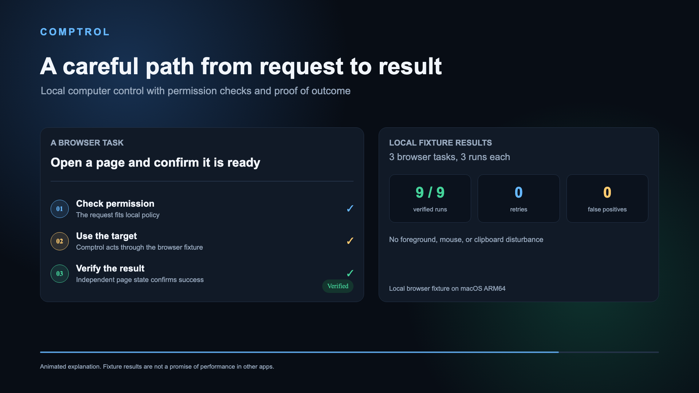

# Comptrol

Comptrol gives an AI assistant a careful way to use your computer. It runs on your device. You describe one task. It checks permission, acts, then confirms what happened.

Comptrol opens selected apps. It controls browser sessions supported by your setup. It edits files. It connects to supported services. Each action stays within the permissions you set.

Comptrol does not claim success just because an app accepted a command. It reports whether the requested result was actually observed. You can inspect what happened later.

## See how it works

[Watch the short demo](media/remotion/out/comptrol.mp4)

The animation explains the flow. It is not a recording of a live computer session.

## What it can do

Comptrol can open selected apps. It can inspect computer state. It can write files inside its own sandbox. It can interact with supported services. Your available actions depend on installed apps, permissions, local settings.

The word adapter means a connection to an app. Some connections use an app's own controls. Others use the browser. Some use built in accessibility tools. The setup guide explains which connections need extra steps.

## Try it

Install comptrolling, the Comptrol package. Add its local server command to a compatible assistant app. Then ask it to list available capabilities. MCP is the connection format that lets assistant apps use Comptrol.

This update uses npm version 0.1.67. Install it with npm to get this release.

[Start here](docs/start.md)

The doctor report separates local setup from actions verified on this computer. Untested connections stay marked as untested.

The local server works with compatible desktop assistants. ChatGPT in a browser cannot reach a program running only on your computer. A separate HTTPS connection is required to use Comptrol there.

## What stays on your computer

Comptrol keeps operation records on your computer. File checkpoints stay there too. Telemetry is off by default. It needs no account. It needs no cloud service. It needs no model API.

Local policy controls changes to apps. It also controls changes to settings. Some sensitive actions need a separate approval saved on your computer. A damaged approval record blocks them.

## A small browser check

The current local browser fixture check passed nine of nine task runs. It recorded zero retries, zero incorrect success reports, zero foreground disturbances. The quickest task medians were 2.58 ms, 2.92 ms, 5.58 ms.

These figures come from three repeated checks against a small local browser fixture on macOS ARM64. They do not predict speed in other apps. They do not prove support on every computer. Browser support can vary.

[Read the full results](bench/results/audit_browser_fixture_20260923.json)

The result file notes that this run used uncommitted source changes.

## Support limits

Comptrol runs on macOS, Windows, Linux. Controls differ by platform. Some routes have only been tested with fixtures. Live support varies with your app setup, permissions.

Comptrol refuses a request when it cannot safely identify the target. It also refuses when it cannot verify the result. You can stop local changes with the emergency stop command. Restarting requires a person at the computer.

## Learn more

[Setup guide](docs/start.md)

[Adapter support](docs/adapters.md)

[Platform support](docs/support.md)

[Security policy](SECURITY.md)

[Privacy](PRIVACY.md)
