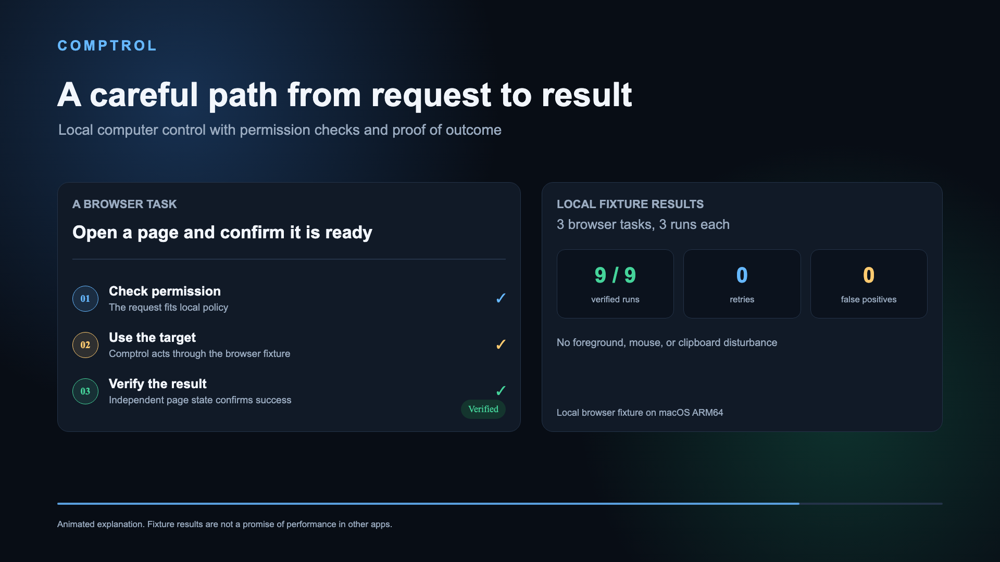

# Comptrol

Comptrol lets an assistant use selected apps on your computer. It checks each action and reports what it could verify.

## Set up Comptrol

Use these steps on Windows, macOS, or Linux. Set up Comptrol on the same computer where you use Chrome and your assistant app.

### 1. Install the tools

You need Git, stable Rust, Python 3, Google Chrome, and an assistant app that can use a local MCP server. MCP lets the assistant call Comptrol on your computer.

### 2. Download and build

Open a terminal and enter these commands.

```sh
git clone https://github.com/Praket7/Comptrol.git
cd Comptrol
cargo build --release -p comptrol
```

### 3. Register Comptrol

Run the setup command from the Comptrol folder.

On Windows, use PowerShell.

```powershell
target\release\comptrol.exe setup
```

On macOS or Linux, use Terminal.

```sh
./target/release/comptrol setup
```

Setup adds Comptrol to the settings for Freebuff, Claude Code, Codex, and OpenCode when their settings files do not already exist. It also prepares the local Chrome connection. It leaves existing settings files unchanged. If your assistant already has a settings file, see [Client settings](docs/clients.md) for the entry to add.

### 4. Add the Chrome extension

1. Open Chrome's Extensions page from the browser menu.
2. Turn on Developer mode.
3. Choose Load unpacked.
4. Select `extensions/comptrol-browser-bridge` inside the Comptrol folder.
5. Check that Chrome shows the Comptrol extension ID `bpnakihocoimajcddkohnpgkepdmdkna`.
6. Accept Chrome's permission request and keep the extension turned on.

The extension lets Comptrol use the Chrome window that you already opened. Chrome asks you to approve the extension. Comptrol does not approve it for you. Click Reload on the extension page after you change its files.

### 5. Check the connection

Close and reopen your assistant, or reload its local server settings. Ask the assistant to run Comptrol's `inspect` tool with `kind` set to `doctor`. Then ask it to run `system.ping`. A working connection reports `ready` as `true` and `verification` as `verified`.

These checks confirm that the assistant reached Comptrol. They do not prove that every app action works. Use the [support guide](docs/support.md) to see what has been checked on each system.

## Give system access

On macOS, open System Settings, then Privacy and Security, then Accessibility. Allow the Comptrol program that you built. Restart your assistant after changing this setting.

On Linux, sign in to your normal desktop before testing app controls. The desktop must provide its accessibility information to apps.

Windows setup does not need this extra permission step.

## What Comptrol can do

Comptrol can open selected apps, inspect their controls, work with supported browser pages, and change files inside its own safe area. Each action follows the permissions on your computer. Comptrol checks the result before it reports success.

Comptrol keeps its action records and file copies on your computer. Data sharing is off by default. It does not need an online account or an AI service key.

## See the steps



[Watch the short video](media/remotion/out/comptrol.mp4)

The video explains the flow. It is not a recording of a live computer session.

## More help

* [Detailed setup](docs/platform-setup.md)
* [Client settings](docs/clients.md)
* [What works today](docs/support.md)
* [App support](docs/adapters.md)
* [Security](SECURITY.md)
* [Privacy](PRIVACY.md)
